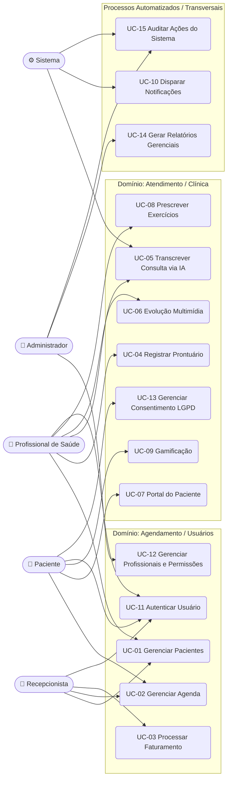

# Use Cases

---

## 2. Atores do Sistema

| Ator | Tipo |
|---|---|
| Recepcionista / Equipe Administrativa | Primário |
| Profissional de Saúde (Otorrino / Fonoaudiólogo) | Primário |
| Paciente | Primário |
| Sistema | Secundário |
| Administrador do Sistema | Primário |

---

## 3. Diagrama de Casos de Uso

---

## 4. Especificações Detalhadas dos Casos de Uso Originais

### UC-01 — Gerenciar Pacientes
- **Ator principal:** Recepcionista | **Ator secundário:** Profissional de Saúde
- **Pré-condições:** Usuário autenticado com permissão de gestão de pacientes.
- **Fluxo principal:**
  1. Ator acessa o módulo "Pacientes".
  2. Sistema exibe lista/busca de pacientes cadastrados.
  3. Ator cadastra novo paciente (dados pessoais, contato, convênio, responsável legal se menor de idade) ou seleciona um existente para edição.
  4. Sistema valida dados obrigatórios (CPF, nome, data de nascimento) e verifica duplicidade.
  5. Sistema persiste os dados e retorna confirmação.
- **Fluxos alternativos:**
  - **A1 – CPF já cadastrado:** sistema bloqueia o cadastro e sugere abrir o prontuário existente.
  - **A2 – Paciente menor de idade:** sistema exige vínculo obrigatório com responsável legal.
- **Pós-condições:** Paciente cadastrado/atualizado e disponível para agendamento e prontuário.
- **Regras de negócio:** CPF único por paciente; campos de saúde sensíveis exigem consentimento LGPD (ver UC-13) antes do primeiro atendimento.

### UC-02 — Gerenciar Agenda de Consultas
- **Ator principal:** Recepcionista | **Ator secundário:** Paciente (via portal)
- **Pré-condições:** Paciente cadastrado; profissional com agenda configurada.
- **Fluxo principal:**
  1. Ator seleciona profissional, data e horário disponível.
  2. Sistema verifica conflito de horário em tempo real (lock otimista no PostgreSQL do serviço de Agendamento).
  3. Sistema confirma o agendamento e dispara evento assíncrono (RabbitMQ) para o UC-10 (notificação).
- **Fluxos alternativos:**
  - **A1 – Conflito de horário:** sistema rejeita e sugere próximos horários livres.
  - **A2 – Remarcação/Cancelamento:** ator seleciona consulta existente, sistema libera o slot e reexecuta a checagem de conflito.
  - **E1 – Falha de concorrência (dois usuários marcando o mesmo horário simultaneamente):** o segundo request deve falhar de forma controlada (HTTP 409) — **ponto de atenção técnica**, ver seção 6.
- **Pós-condições:** Consulta/exame confirmado, cancelado ou remarcado; evento de notificação publicado.
- **Regras de negócio:** Não é permitido overbooking na mesma sala/equipamento; cancelamento tardio (ex.: <24h) pode gerar regra de cobrança (relaciona-se ao UC-03).

### UC-03 — Processar Faturamento
- **Ator principal:** Recepcionista
- **Pré-condições:** Consulta/exame realizado ou agendado; tabela de preços/convênios parametrizada.
- **Fluxo principal:**
  1. Ator seleciona a consulta/exame a faturar.
  2. Sistema calcula valor com base em tabela de preços, convênio ou particular.
  3. Ator registra forma de pagamento (dinheiro, cartão, PIX, convênio).
  4. Sistema gera recibo/nota e atualiza status financeiro do atendimento.
- **Fluxos alternativos:**
  - **A1 – Pagamento via convênio:** sistema registra a guia/autorização vinculada à operadora.
  - **A2 – Pagamento parcial/parcelado:** sistema registra saldo devedor.
- **Pós-condições:** Atendimento marcado como faturado; dados disponíveis para relatórios financeiros.
- **Regras de negócio:** Nenhuma consulta pode ser faturada duas vezes; estornos exigem justificativa registrada (trilha de auditoria — ver UC-15).

### UC-04 — Registrar Prontuário e Anamnese
- **Ator principal:** Profissional de Saúde
- **Pré-condições:** Consulta em andamento ou finalizada; paciente com cadastro válido.
- **Fluxo principal:**
  1. Profissional abre o prontuário do paciente.
  2. Preenche anamnese (texto livre ou assistido por IA — UC-05).
  3. Preenche componentes interativos específicos: **audiograma** (registro de limiares auditivos por frequência/orelha) e **curva timpanométrica**.
  4. Sistema salva o registro com timestamp e vínculo ao profissional responsável (assinatura eletrônica/registro imutável).
- **Fluxos alternativos:**
  - **A1 – Edição de prontuário já salvo:** sistema mantém versionamento (não permite exclusão de registros clínicos, apenas complementação — exigência regulatória do CFM/CFFa).
- **Pós-condições:** Prontuário atualizado e auditável.
- **Regras de negócio:** Prontuário médico não pode ser fisicamente deletado (obrigação legal de guarda); apenas o profissional responsável ou papéis com permissão elevada podem editar registros já assinados.

### UC-05 — Transcrever Consulta via IA
- **Ator principal:** Profissional de Saúde | **Ator secundário:** Sistema (Whisper)
- **Pré-condições:** Consentimento do paciente para gravação de áudio (LGPD — dado sensível de saúde).
- **Fluxo principal:**
  1. Profissional inicia a gravação de áudio da consulta.
  2. Ao finalizar, o áudio é enviado para processamento assíncrono via fila (RabbitMQ) — **não deve bloquear a UI do profissional**.
  3. Serviço de IA (Whisper) transcreve o áudio.
  4. Sistema preenche automaticamente o campo de anamnese com o texto transcrito, marcado como "gerado por IA — pendente de revisão".
  5. Profissional revisa e confirma/edita o texto antes de assiná-lo.
- **Fluxos alternativos:**
  - **E1 – Falha na transcrição:** sistema notifica o profissional e mantém o áudio bruto disponível para preenchimento manual.
- **Pós-condições:** Anamnese preenchida (rascunho) vinculada ao áudio original.
- **Regras de negócio:** **Texto gerado por IA nunca é aceito como registro final sem revisão humana explícita do profissional** — requisito crítico de responsabilidade clínica/legal.

### UC-06 — Gerenciar Evolução Multimídia
- **Ator principal:** Fonoaudiólogo
- **Pré-condições:** Paciente com consentimento para armazenamento de mídia (voz/vídeo).
- **Fluxo principal:**
  1. Fonoaudiólogo faz upload de gravação de voz ou vídeo curto durante o tratamento.
  2. Sistema armazena o arquivo no AWS S3 (bucket privado, com criptografia em repouso).
  3. Sistema associa a mídia à linha do tempo do tratamento do paciente.
  4. Em sessão futura, o fonoaudiólogo reproduz e compara arquivos "antes e depois" lado a lado.
- **Fluxos alternativos:**
  - **A1 – Arquivo corrompido/formato inválido:** sistema rejeita o upload e informa os formatos aceitos.
- **Pós-condições:** Mídia disponível de forma segura e vinculada ao histórico clínico.
- **Regras de negócio:** Acesso aos arquivos deve ser via **URL assinada com expiração curta** (nunca pública); retenção e exclusão seguem política de guarda de prontuário definida com o jurídico da clínica.

### UC-07 — Acessar Portal do Paciente
- **Ator principal:** Paciente
- **Pré-condições:** Paciente cadastrado com credenciais de acesso ativas.
- **Fluxo principal:**
  1. Paciente realiza login (UC-11).
  2. Visualiza histórico de atendimentos, baixa receitas médicas em PDF.
  3. Acessa link de telemedicina quando aplicável.
- **Fluxos alternativos:**
  - **A1 – Receita ainda não emitida:** sistema informa que o documento está pendente de liberação pelo profissional.
- **Pós-condições:** Paciente com acesso self-service às próprias informações.
- **Regras de negócio:** Paciente só acessa os próprios dados (ou de dependentes vinculados legalmente).

### UC-08 — Prescrever Exercícios Vocais
- **Ator principal:** Fonoaudiólogo
- **Pré-condições:** Prontuário do paciente com diagnóstico/plano terapêutico definido.
- **Fluxo principal:**
  1. Fonoaudiólogo seleciona exercícios de uma biblioteca (ou cria um novo) e define frequência/duração da rotina.
  2. Sistema associa a prescrição ao paciente e disponibiliza no portal (UC-07/UC-09).
- **Pós-condições:** Rotina de exercícios visível para o paciente.
- **Regras de negócio:** Só o fonoaudiólogo responsável pelo caso pode prescrever ou alterar a rotina.

### UC-09 — Interagir com Gamificação de Tratamento
- **Ator principal:** Paciente
- **Pré-condições:** Rotina de exercícios prescrita (UC-08).
- **Fluxo principal:**
  1. Paciente realiza o exercício e marca conclusão no portal.
  2. Sistema atualiza contador de "ofensiva" (streak) e progresso.
  3. Sistema disponibiliza indicadores de engajamento ao fonoaudiólogo (aderência ao tratamento).
- **Fluxos alternativos:**
  - **A1 – Quebra de streak:** sistema reinicia o contador e pode disparar notificação motivacional (integra com UC-10).
- **Pós-condições:** Progresso do paciente registrado e visível para o profissional.
- **Regras de negócio:** O registro de conclusão é autodeclarado pelo paciente (não há verificação automática de execução correta do exercício) — **importante deixar isso explícito no requisito**, pois impacta a confiabilidade do indicador clínico.

### UC-10 — Disparar Notificações
- **Ator principal:** Sistema
- **Pré-condições:** Evento relevante publicado na fila (ex.: novo agendamento, lembrete de consulta, streak quebrada).
- **Fluxo principal:**
  1. Sistema consome eventos da fila RabbitMQ.
  2. Seleciona canal (e-mail, SMS ou WhatsApp) conforme preferência do paciente.
  3. Envia notificação e registra status de entrega.
- **Fluxos alternativos:**
  - **E1 – Falha de envio:** sistema aplica retry com backoff e, após limite de tentativas, registra falha para acompanhamento manual.
- **Pós-condições:** Notificação entregue (ou falha registrada).
- **Regras de negócio:** Respeitar opt-out do paciente (obrigatório para SMS/WhatsApp marketing, recomendável mesmo para lembretes).

---

## 5. Lacunas Identificadas e Casos de Uso Adicionais Sugeridos

O levantamento original cobre bem o "caminho feliz" clínico e administrativo, mas **falta formalizar funcionalidades que já estão descritas no README como features, porém sem UC correspondente**. Recomenda-se incluir:

### UC-11 — Autenticar Usuário (Login/Logout/Recuperação de Senha)
Todo ator (Recepcionista, Profissional, Paciente) precisa autenticar-se. Hoje isso está implícito, mas deve ser um UC formal do "Serviço de Autenticação/Usuários", incluindo MFA (recomendado para profissionais de saúde, dado o volume de dados sensíveis).

### UC-12 — Gerenciar Profissionais e Permissões
O README cita **"Gestão de Profissionais... com controle dinâmico de agendas"**, mas não há UC correspondente. É necessário definir quem cadastra médicos/fonoaudiólogos, define especialidades, horários de atendimento e níveis de permissão (RBAC).

### UC-13 — Gerenciar Consentimento LGPD
Como o sistema trata **dados sensíveis de saúde** (áudio, vídeo, diagnóstico, audiograma), é obrigatório um UC de consentimento explícito e revogável (paciente aceita/recusa gravação, compartilhamento com terceiros, etc.), com registro de data/hora e versão do termo aceito.

### UC-14 — Gerar Relatórios Gerenciais
Faturamento, ocupação de agenda, taxa de adesão ao tratamento (via gamificação) são dados valiosos para a gestão da clínica, mas não há UC de relatórios/dashboards.

### UC-15 — Auditar Ações do Sistema
Dado o contexto de prontuário eletrônico de saúde, é praticamente uma exigência regulatória (e boa prática de segurança) registrar **log de auditoria imutável** de quem acessou/alterou qual prontuário e quando.

### Sugestões adicionais (menor prioridade, avaliar com o cliente/orientador)
- **UC-16 — Gerenciar Convênios/Planos de Saúde** (cadastro de operadoras, tabelas de preço, glosas), caso a clínica atenda convênio.
- **UC-17 — Realizar Teleconsulta** (o README menciona "integração com telemedicina" no portal, mas o UC-07 só cobre "acessar link" — vale detalhar se a videochamada é nativa ou integração com terceiro, ex. Zoom/Whereby).

---

## 6. Riscos e Pontos de Atenção Técnica

| # | Risco | UC relacionado | Recomendação |
|---|---|---|---|
| 1 | Condição de corrida em agendamento simultâneo | UC-02 | Usar transação com lock otimista (version/ETag) na tabela de agenda; retornar 409 em conflito |
| 2 | Transcrição por IA sendo aceita sem revisão | UC-05 | Campo de anamnese gerado por IA deve ter flag obrigatório de revisão humana antes de "assinar" o prontuário |
| 3 | Exposição de mídia sensível (S3) | UC-06 | URLs assinadas com TTL curto; nunca bucket público; criptografia em repouso e em trânsito |
| 4 | Ausência de consentimento formal para dados sensíveis | UC-05, UC-06, UC-13 | Implementar UC-13 antes de liberar gravação de áudio/vídeo em produção |
| 5 | Falta de trilha de auditoria em prontuário | UC-04, UC-15 | Prontuário deve ser append-only / versionado, nunca deletável |
| 6 | Confiabilidade do dado de gamificação | UC-09 | Deixar explícito no requisito que a marcação é autodeclarada, não verificada tecnicamente |
| 7 | Processamento síncrono de IA bloqueando o profissional | UC-05 | Confirma o uso de fila assíncrona (RabbitMQ) já previsto na arquitetura — reforçar no fluxo do UC |

---

## 7. Matriz de Rastreabilidade

| UC | Nome | Ator Principal | Domínio/Microsserviço (DDD) | Prioridade sugerida (MoSCoW) |
|---|---|---|---|---|
| UC-01 | Gerenciar Pacientes | Recepcionista | Agendamento/Usuários | Must have |
| UC-02 | Gerenciar Agenda de Consultas | Recepcionista/Paciente | Agendamento/Usuários | Must have |
| UC-03 | Processar Faturamento | Recepcionista | Agendamento/Usuários | Must have |
| UC-04 | Registrar Prontuário e Anamnese | Profissional | Atendimento/Clínica | Must have |
| UC-05 | Transcrever Consulta via IA | Profissional/Sistema | Atendimento/Clínica | Should have |
| UC-06 | Gerenciar Evolução Multimídia | Fonoaudiólogo | Atendimento/Clínica | Should have |
| UC-07 | Acessar Portal do Paciente | Paciente | Atendimento/Clínica | Must have |
| UC-08 | Prescrever Exercícios Vocais | Fonoaudiólogo | Atendimento/Clínica | Should have |
| UC-09 | Interagir com Gamificação | Paciente | Atendimento/Clínica | Could have |
| UC-10 | Disparar Notificações | Sistema | Transversal (mensageria) | Must have |
| UC-11 *(novo)* | Autenticar Usuário | Todos | Agendamento/Usuários | Must have |
| UC-12 *(novo)* | Gerenciar Profissionais e Permissões | Administrador | Agendamento/Usuários | Must have |
| UC-13 *(novo)* | Gerenciar Consentimento LGPD | Paciente/Administrador | Atendimento/Clínica | Must have |
| UC-14 *(novo)* | Gerar Relatórios Gerenciais | Administrador | Transversal | Could have |
| UC-15 *(novo)* | Auditar Ações do Sistema | Sistema | Transversal | Should have |

---

## 8. Recomendações Finais

1. **Priorizar UC-11, UC-12 e UC-13 no MVP.** Sem autenticação, gestão de profissionais e consentimento LGPD, os demais casos de uso (especialmente os que envolvem dados sensíveis de saúde — UC-04, UC-05, UC-06) não podem ir para produção com segurança jurídica.
2. **Formalizar os fluxos de exceção antes de escrever os testes E2E** — o levantamento original tinha apenas o "caminho feliz"; os fluxos alternativos/exceção acima já dão base para os cenários de teste (Pytest/E2E) mencionados no README.
3. **Tratar UC-05 e UC-06 como bounded contexts sensíveis**: recomenda-se que a equipe jurídica/orientador valide o texto de consentimento antes da implementação, já que envolve gravação de voz/vídeo de pacientes (dado biométrico sensível pela LGPD).
4. **Avaliar se UC-09 (Gamificação) deveria ser um bounded context próprio** ("Engajamento") em vez de estar dentro de "Atendimento/Clínica", já que sua lógica (streaks, badges) é conceitualmente distinta de prontuário/diagnóstico — decisão de modelagem a discutir com a equipe.
5. Este documento pode ser convertido diretamente em **User Stories no formato "Como [ator], quero [ação], para [benefício]"** para alimentar o backlog no GitHub Projects/Kanban já citado no README.

